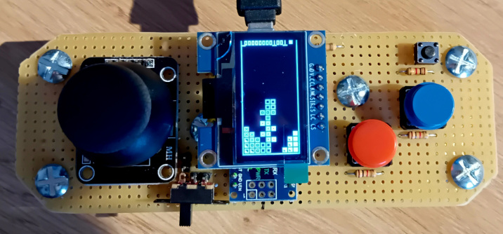

# DIY Tetris Console

**DIY Tetris Console** is an educational, non-commercial project that recreates the gameplay mechanics of classic falling-block puzzle games.  
The goal of this project is purely **technical and pedagogical**: exploring how to fit a complete game into an **Arduino Nano**, a microcontroller with extremely limited memory and processing power.

This project demonstrates:
- Efficient memory usage
- Minimalist graphics techniques
- Input handling on constrained hardware
- Game loop design under tight CPU/RAM limits

## Educational Purpose Only
This project is built **for learning, experimentation, and personal challenge**, not for commercial distribution.

It showcases how to:
- Write efficient C++ code for Arduino
- Optimize game logic under strict hardware constraints
- Implement a full game on a device with only 2 KB RAM

## Legal Notice
- This project is **not affiliated with, endorsed by, or licensed from the official Tetris brand**.
- The term **"DIY Tetris Console"** is used only to refer to the *type* of game being recreated from scratch for educational purposes.
- All code, graphics, and sounds are **original** or free-to-use assets.
- **No copyrighted material** from the official Tetris game has been used.
- This repository is **non-commercial** and intended solely for hobbyist experimentation and learning.

## Features
- Falling block mechanics
- Rotation and movement
- Line clearing logic
- Score calculation
- Compact rendering for small OLED or LCD displays
- Fully optimized for **Arduino Nano** (ATmega328P)

---

## Getting Started (PlatformIO)

### Requirements
- PlatformIO Core or PlatformIO IDE (VS Code recommended)
- Arduino Nano (ATmega328P)
- OLED/LCD display (e.g., SSD1306)
- 2–4 buttons for controls
- Optional: passive buzzer

---

## License

This project is distributed under the MIT License.
See the LICENSE file for details.

## Special Thanks
A thank-you to **Alexey Pajitnov**, the original creator of Tetris — for the **astronomical number of hours of productivity lost worldwide**, and for inspiring generations of developers to stack blocks instead of doing real work.